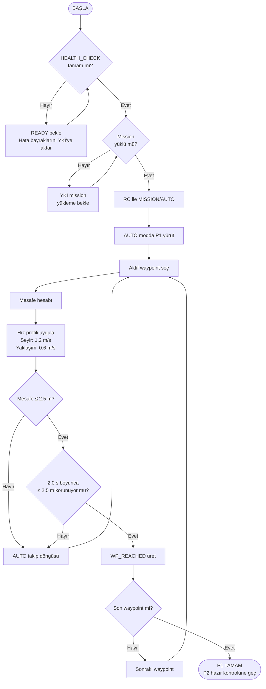
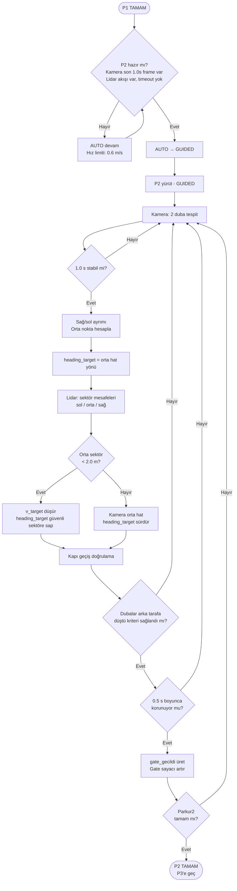
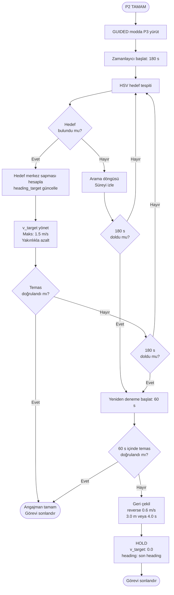

# 1. UÇTAN UCA SİSTEM AKIŞI

Bu bölüm, İDA'ya güç verilmesinden itibaren görev noktalarının teslim alınması, görev planının YKİ üzerinde hazırlanması, kablosuz mission yükleme, görevin RC ile başlatılması, Parkur1–Parkur2–Parkur3 icrası, parkurlar arası otomatik geçiş, emniyet ve fail-safe davranışları, görevin sonlandırılması ve pasif beklemeye geçişe kadar olan fonksiyonel süreci uçtan uca tanımlar. Görev başladıktan sonra acil durdurma dışında manuel komut kabul edilmez.

---

## 1.1 Sistem Bileşenleri ve Roller

**1) Pixhawk (ArduPilot / ArduRover)**
- Araç modları: AUTO, GUIDED, HOLD
- Durum kestirimi: GNSS konum (lat, lon), yer hızı, heading/yaw, roll/pitch
- Düşük seviye kontrol: hız kontrolü + heading kontrolü + thruster/ESC sürüş komutları
- Mission yürütme (AUTO) ve setpoint takip (GUIDED)

**2) Raspberry Pi**
- Üst seviye otonomi: algılama, durum makinesi, olay bayrakları, setpoint üretimi
- Parkur2 ve Parkur3'te her kontrol döngüsünde `v_target` ve `heading_target` üretimi
- Sensör işleme, kayıt, zaman damgası yönetimi

**3) STM32**
- Çevresel sensör okuma: sıcaklık, RTC, yağmur
- Verilerin Raspberry Pi'ya iletilmesi (sağlık ve kayıt amaçlı)

**4) YKİ (Yer Kontrol İstasyonu)**
- Birincil yazılım: Mission Planner
- Yedek yazılım: QGroundControl
- Mission hazırlama, mission yükleme ve telemetri izleme

---

## 1.2 Haberleşme Kanal Ayrımı ve Kısıtlar (Operasyon Prensibi)

- RC ve uzaktan güç kesme tetik kanalı **Crossfire** üzerinden yürütülür; bu kanal RC komutları ve E-stop tetik için kullanılır.
- Mission yükleme ve telemetri akışı Pixhawk ↔ YKİ arasında **433 MHz** air/ground seri telemetri modülleri ile **MAVLink** üzerinden sağlanır.
- 2.4–2.8 GHz ve 5.15–5.85 GHz aralıklarında çalışan modül/bileşen kullanılmaz. Sistemlerde yer alan tüm bilgisayarların dahili Wi-Fi özellikleri kapalıdır.
- İDA'dan YKİ'ye ve yer tarafına herhangi bir şekilde görüntü aktarımı yapılmaz; analog veya dijital canlı görüntü transferi kullanılmaz.
- Haberleşme altyapısında yalnızca telekomut ve telemetri sağlayan alıcı-verici modülleri kullanılır.
- Haberleşme modüllerinde frekans kanalı seçilebilirlik uygulanır; telemetri ve RC modülleri saha frekans planına uygun kanala alınır.
- Hücresel bağlantı (4G, LTE vb.) sağlayan modemler kullanılmaz.

---

## 1.3 Güç Verme, Boot ve Sağlık Kontrol Süreci

**Adım 1: Güç verilmesi**
- Ana güç verildiğinde Pixhawk ve Raspberry Pi açılır.

**Adım 2: Raspberry Pi servis başlatma**
Raspberry Pi açılışıyla otonomi servisleri kontrollü şekilde devreye girer:
- Pixhawk MAVLink bağlantısı
- Kamera ve lidar sürücüleri
- STM32 haberleşmesi
- Loglama ve sistem izleme servisleri

**Adım 3: Sağlık kontrolleri (HEALTH_CHECK)**
Sistem, görev yükleme ve görev başlatma aşamasına geçmeden önce aşağıdaki kontrolleri yapar:
- Pixhawk ↔ Raspberry Pi MAVLink bağlantısının aktif olması
- YKİ ↔ Pixhawk 433 telemetri linkinin aktif olması ve MAVLink heartbeat sürekliliği
- RC linkinin aktif olması (Crossfire link quality/RSSI)
- E-stop hattının armed/safe durumu
- Kamera akışının alınması ve son 1.0 s içinde frame akışının sürekliliği
- Lidar veri akışının alınması ve lidar timeout olmaması
- Kayıt ortamlarının yazılabilir olması (Raspberry Pi yerel depolama + USB)

Bu kontroller tamamlandığında sistem **READY** durumuna geçer; YKİ ekranında araç mod ve durum bilgileri izlenir.

---

## 1.4 Görev Noktalarının Teslim Alınması ve YKİ'de Hazırlık

**Adım 4: Görev noktalarının alınması**
- Görev noktaları, `dd.ddddddd` formatında coğrafik koordinatlar olarak bir dosya halinde dağıtılır.
- Takım, kendi USB belleği ile hakem çadırından bu dosyayı teslim alır.
- Yarışma sırası gelmeden önce görev noktaları YKİ'de tanımlanmış olacak şekilde hazırlık tamamlanır.

**Adım 5: Görev yükleme zamanlaması**
- Görev yükleme, yarışma alanına giriş sonrası İDA'ya güç verildikten sonra yapılır.
- Görev yükleme karada veya denizde gerçekleştirilir.
- Görev yükleme aşamasında YKİ üzerinde yalnızca YKİ arayüzü çalışır; görüntü işleme, sensör işleme veya otonomi fonksiyonu YKİ üzerinde çalıştırılmaz.

---

## 1.5 Kablosuz Mission Yükleme (YKİ → Pixhawk, MAVLink)

**Adım 6: Mission oluşturma**
- YKİ üzerinde parkur sıralamasına uygun mission planı hazırlanır ve doğrulanır.

**Adım 7: Mission yükleme**
- Mission, YKİ'den Pixhawk'a 433 telemetri linki üzerinden MAVLink ile kablosuz aktarılır.
- YKİ üzerinde mission uploaded/validated doğrulaması alınır ve araç göreve hazır hâle gelir.

---

## 1.6 Görev Başlatma ve Komut Kısıtı

**Adım 8: Görev başlatma**
- Görev, RC üzerinden tek seferlik mod geçişi ile başlatılır: `MISSION/AUTO`.

**Adım 9: Görev başladıktan sonra komut kısıtı**
- Görev başladıktan sonra acil durdurma dışında manuel komut gönderilmez ve kabul edilmez.
- YKİ görev süresince telemetri izleme ve durum takibi için kullanılır.

---

## 1.7 Parkur Yapısı, Otomatik Geçiş ve Haritalama Kısıtı

- Yarışma 3 parkurdan oluşur ve görevler sırasıyla tek seferde yapılır.
- Bir parkurdan diğerine geçiş, önceki parkurun tamamlanmasıyla mümkündür.
- Parkurlar arası geçiş, kullanıcı (YKİ, RC vb.) girişi olmadan otomatik algılanır ve yapılır.
- Engellerin konum bilgileri paylaşılmaz.
- Yarışma parkurlarının önceden haritalanmasına izin verilmez; algı ve kararlar görev anında sensör verileriyle üretilir.

---

## 1.8 Parkur1 İcrası (AUTO: Waypoint Takibi)

**Adım 10: AUTO modda mission yürütme**
- Pixhawk AUTO modda mission waypoint'lerini sırasıyla takip eder.

**Adım 11: Hız profili**
- Seyir hızı: `1.2 m/s`
- Waypoint yaklaşım hızı: `0.6 m/s`

**Adım 12: Waypoint tamamlanma ölçütü**
- `R_wp`: 2.5 m yarıçap içine girme
- `T_hold`: 2.0 s boyunca bu yarıçap içinde kalma
- `WP_REACHED` olayı üretilir, bir sonraki waypoint'e geçilir.
- Parkur1 son waypoint tamamlandığında Parkur1 tamam olayı üretilir.

---

## 1.9 Parkur1 → Parkur2 Geçişi (AUTO → GUIDED, P2 Hazır Kontrolü)

**Adım 13: P2 hazır doğrulaması**
Parkur2'ye geçmeden önce sistem şu koşulları doğrular:
- Kamera aktif ve son 1.0 s içinde frame akışı var
- Lidar veri akışı var ve lidar timeout yok

**Adım 14: Hazır değilse geçiş erteleme**
- Koşullar sağlanmıyorsa AUTO modda kalınır.
- Hız limiti `0.6 m/s` seviyesinde tutulur.
- Koşullar sağlanana kadar geçiş bekletilir.

**Adım 15: Hazırsa GUIDED'e geçiş**
- Koşullar sağlanınca AUTO → GUIDED geçişi yapılır ve Parkur2 yürütmeye alınır.

---

## 1.10 Parkur2 İcrası (GUIDED: Kapı Geçişi + Yakın Engel Önleme)

Parkur2'de gate algısı kamera ile yapılır; lidar yalnızca çarpışma önleme ve güvenli sapma için kullanılır.

**Adım 16: Kamera ile kapı yönelimi**
- Kamerada iki duba tespit edilir ve sağ/sol ayrımı yapılır.
- Dubaların orta noktası hesaplanır; orta hattın yönü `heading_target` olarak kullanılır.
- Duba çifti stabilitesi: 1.0 s süreyle iki duba kararlı tespit.

**Adım 17: Kapı geçişi doğrulama ve olay bayrağı**
Geçiş tamamlanma kararı:
- Dubalar "arka tarafa düştü" geometrik kriteri (bearing işareti değişimi)
- 0.5 s doğrulama penceresi
- `gate_gecildi` olayı üretilir ve gate sayacı güncellenir.

**Adım 18: Lidar ile engel tanımı (sektör bazlı) ve kaçınma**
- Ön yarım düzlem 3 sektöre bölünür: sol, orta, sağ
- `D_min`: 2.0 m
- Engel bayrağı: ilgili sektörde mesafe < 2.0 m
- Orta sektör öncelikli: orta sektörde mesafe < 2.0 m ise kaçınma zorunludur

Kaçınma davranışı:
- Orta sektörde engel varsa `v_target` düşürülür; `heading_target` güvenli sektöre (sol veya sağ) sapacak şekilde revize edilir.
- Engel etkisi kalkınca kamera tabanlı kapı orta hattı hedeflemesine geri dönülür.

**Adım 19: Parkur2 tamamlanma ve Parkur3'e geçiş**
- Parkur2 tamamlanma, gate olayları ve görev ilerleme koşulları ile doğrulanır.
- Parkur2 tamamlandığında Parkur3'e geçilir; GUIDED mod sürdürülür.

---

## 1.11 Parkur3 İcrası (GUIDED: Hedefleme ve Kamikaze Angajman)

**Adım 20: HSV hedef tespiti ve merkezleme**
- Kamera görüntüsü HSV tabanlı işlenir; hedef maskesi çıkarılır.
- Hedef görüntü merkezi bulunur; merkez sapması heading düzeltmesine çevrilir.
- `heading_target` hedefe merkezleme yapacak şekilde güncellenir.

**Adım 21: Hız yönetimi**
- Angajman yaklaşımı hız limiti: `1.5 m/s`
- Hedef yakınlaştıkça `v_target` kontrollü düşürülür.

**Adım 22: Temas doğrulama**
- Temas sensörü varsa temas olayı ile angajman tamam olayı üretilir.
- Temas sensörü yoksa hedef yakınlık göstergesi + ani yavaşlama + süreklilik birlikte değerlendirilir.

**Adım 23: Timeout ve yeniden deneme**
- 180 s içinde angajman tamamlanamazsa timeout oluşur.
- 1 kez yeniden deneme uygulanır: 60 s.
- Yeniden deneme başarısızsa geri çekilme uygulanır.

**Adım 24: Geri çekilme ve pasif**
- `reverse` `0.6 m/s` ile 3.0 m geri veya en fazla 4.0 s
- Ardından `v_target` `0.0 m/s` yapılır ve HOLD/pasif duruma geçilir.

---

## 1.12 Telemetri Kaybı Tetik ve Fail-safe Davranışı

Fail-safe tetik kaynağı **MAVLink heartbeat timeout** olarak tanımlanır; 433 modem RSSI/link quality erken uyarı amaçlı izlenir.

| Durum | Eşik |
|---|---|
| Heartbeat yokluğu – Uyarı | 5.0 s |
| Heartbeat yokluğu – Fail-safe | 30.0 s |

**Fail-safe davranışı:**
- < 5 s telemetri kaybı: görev yürütme devam eder
- ≥ 30 s telemetri kaybı:
  - `v_target` `0.3 m/s` seviyesine düşürülür
  - Ardından HOLD uygulanır: `v_target = 0.0 m/s`, `heading_target` = son geçerli heading
  - Konum tutma uygulanmaz.

---

## 1.13 Güç Kesme Emniyet Akışı (Araç Üzeri + Uzaktan)

**Adım 25: Araç üzeri güç kesme**
- Araç üzerinde, üzerine basıldığı veya çevrildiği zaman motor ve aktüatörlerden gücü kesen kırmızı bir anahtar bulunur.

**Adım 26: Uzaktan güç kesme**
- RC üzerinden tetiklenen bağımsız E-stop hattı, ana güç kontaktörünü düşürerek ESC beslemesini fiziksel olarak keser.
- Güç kesme yaklaşımında motorlara gönderilen sinyallerin kesilmesi yeterli kabul edilmez; motor gücü fiziksel olarak kesilir.

---

## 1.14 Görev Sonlandırma, Pasif Bekleme ve Geri Kazanım

- Görev Parkur3 sonunda tamamlanır ve araç HOLD/pasif duruma geçer.
- Araç geri kazanımı yarış prosedürüne uygun şekilde manuel olarak gerçekleştirilir.

---

## 1.15 Otonomi Kabiliyeti Gösterimi Videosu (Uygulama Akışı ve İçerik)

Otonomi kabiliyeti gösterimi, İDA'nın temel otonomi ve denizcilik isterlerini karşılayabildiğini göstermek üzere kesintisiz tek video akışıyla yürütülür:

- İDA ve YKİ arasında kablosuz bağlantı sağlanır; İDA bilgileri YKİ üzerinde gösterilir.
- YKİ üzerinden 4 noktalı görev tanımlanır (dikdörtgen oluşturacak şekilde) ve İDA'ya gönderilir.
- YKİ veya RC üzerinden verilen komutla görev başlatılır; son noktaya ulaşıldığında görev tamamlanır.
- Görev sonrası İDA başlangıç noktasına manuel olarak döndürülür.
- Dönüşün ardından motorlar veya güç, güvenlik anahtarı ile kapatılır ve RC'den manuel komut verilse dahi motorların hareket etmediği gösterilir.
- İDA kapakları açılarak su almadığı gösterilir.

**Video ekran düzeni ve içerik:**
Video ekranı 3 parçaya bölünür:

1. YKİ ekran görüntüsü
2. Temel grafikler (senkron):
   - Gerçek hız ve hız isteği (setpoint)
   - Gerçek heading/yaw ve heading/yaw isteği (setpoint)
   - Thrusterlardan kuvvet isteği
3. Dış kamera görüntüsü (RC kumanda, İDA'nın suda hareketi, İDA'nın iç görüntüsü vb.)

- İDA'nın görev yaptığı aşamada YKİ ekranı ile İDA hareketleri senkron görünür.
- Video çözünürlüğü en az **720p**, toplam süre **en az 2 dakika – en fazla 5 dakika** olacak şekilde hazırlanır.

---

## 1.16 Veri Kayıt ve Teslim Süreci (3 Dosya Yapısı)

Otonomi amacıyla kullanılan veriler görev boyunca zaman etiketli olarak kaydedilir ve 3 dosya halinde hazırlanır:

**Dosya 1: Otonomi sensörleri veri seti**
- İşlenmiş kamera verisi:
  - En az 1 Hz
  - Her frame zaman etiketli
  - `mp4` formatında
  - Tespit ve takip sonucunda obje çerçeve çizimleri ve sınıf bilgileri görünür
- Kamera dışında kullanılan otonomi sensörleri (lidar vb.):
  - Her sensör tipi için ayrı `mp4`
  - En az 1 Hz
  - Zaman etiketli
  - Kümeleme/ayırma gibi işlem yapıldıysa görünür

**Dosya 2: Araç telemetri verisi**
- En az 1 Hz
- Konum (lat, lon)
- Hız (yer hızı)
- Yönelim açıları (roll, pitch, heading)
- Hız setpoint
- Yön setpoint
- `csv` formatı
- CSV ilk satır header olacak şekilde sütun tanımları içerir

**Dosya 3: Lokal harita/cost map/engel haritası**
- En az 1 Hz

**Zaman damgası yönetimi:**
- Birincil zaman tabanı GNSS time (Pixhawk)
- GNSS yokluğunda time-since-boot ve Raspberry Pi monotonic zaman tabanı

---
---

# 2. ALGORİTMA TASARIMLARI

Bu bölüm, uçtan uca sistem akışında tanımlanan tüm adımlar için sensör verilerinin nasıl kullanıldığını, karar üretiminin nasıl yapıldığını ve kontrol çıktılarının nasıl üretildiğini tanımlar. Her bir parkur için metin tabanlı akış diyagramı formatında algoritmik yapı ayrıca verilir.

---

## 2.1 Ortak Algoritmik Yapı

### 2.1.1 Veri kaynakları ve kullanımı

| Kaynak | Kullanım |
|---|---|
| **GNSS** (Pixhawk) | Konum, yer hızı; waypoint tamamlanma, parkur geçişleri |
| **IMU** (Pixhawk) | Heading/yaw, roll/pitch; heading kontrol geri bildirimi ve sağlık izleme |
| **Kamera** (Raspberry Pi) | Parkur2: duba tespiti, sağ/sol ayrımı, orta hat yönelimi, kapı geçiş doğrulama / Parkur3: HSV hedef tespiti, merkez sapması, yakınlık göstergesi |
| **Lidar** (Raspberry Pi) | Sektör bazlı engel yakınlık metriği; çarpışma önleme ve güvenli sapma |
| **Telemetri** (433 MAVLink) | Mission yükleme, telemetri izleme, heartbeat timeout ile fail-safe tetik |
| **RC** (Crossfire) | Görev başlatma mod tetik, uzaktan güç kesme tetik |
| **STM32** | Çevresel sensör verileri (kayıt ve sağlık) |

### 2.1.2 Kontrol çıktıları ve uygulama katmanı

- **Parkur1:** AUTO modda Pixhawk mission yürütür; hız limitleri parkur mantığına göre uygulanır.
- **Parkur2 ve Parkur3:** GUIDED modda Raspberry Pi setpoint üretir:
  - `v_target`
  - `heading_target`

  Pixhawk bu setpoint'leri düşük seviye kontrolcüleriyle thruster/ESC komutuna dönüştürür.

- **Fail-safe:** HOLD modda hız 0 ve heading koruma uygulanır:
  - `v_target = 0.0`
  - `heading_target` = son geçerli heading

### 2.1.3 Ortak eşikler ve zamanlamalar

| Parametre | Değer |
|---|---|
| Waypoint tamamlanma yarıçapı `R_wp` | 2.5 m |
| Waypoint tutma süresi `T_hold` | 2.0 s |
| Parkur2 duba stabilitesi | 1.0 s |
| Parkur2 kapı doğrulama penceresi | 0.5 s |
| Lidar engel eşiği `D_min` | 2.0 m (3 sektör: sol, orta, sağ – orta sektör öncelikli) |
| Parkur3 timeout | 180 s |
| Parkur3 yeniden deneme süresi | 60 s (1 kez) |
| Parkur3 geri çekilme | `reverse 0.6 m/s` ile 3.0 m veya 4.0 s |

### 2.1.4 Fail-safe algılama algoritması

- MAVLink heartbeat izlenir.
- Heartbeat yokluğu **5.0 s** olduğunda uyarı bayrağı üretilir.
- Heartbeat yokluğu **30.0 s** olduğunda fail-safe akışı başlatılır:
  - `v_target` `0.3 m/s` seviyesine düşürülür
  - Kısa geçiş sonrası HOLD uygulanır: `v_target = 0.0` ve `heading_target` = son heading

---

## 2.2 Parkur1 Algoritması ve Akış Diyagramı (AUTO)

### 2.2.1 Algoritma tanımı

Parkur1'de Pixhawk AUTO modda mission waypoint'lerini takip eder. Waypoint tamamlanması mesafe ve süreklilik ile doğrulanır. Hız profili seyir ve yaklaşım fazlarından oluşur.

### 2.2.2 Akış diyagramı

---

## 2.3 Parkur2 Algoritması ve Akış Diyagramı (GUIDED)

### 2.3.1 Algoritma tanımı

Parkur2'ye geçiş AUTO → GUIDED ile yapılır ve geçiş öncesi kamera ve lidar akışı doğrulanır. Parkur2'de kapı geçiş hedeflemesi kamera ile yürütülür. Lidar, sektör bazlı minimum mesafe eşiğiyle çarpışma önleme ve güvenli sapma için kullanılır.

### 2.3.2 Akış diyagramı

---

## 2.4 Parkur3 Algoritması ve Akış Diyagramı (GUIDED)

### 2.4.1 Algoritma tanımı

Parkur3'te HSV hedef tespiti ile hedef merkezleme yapılır. Setpoint üretimi heading merkezleme ve hız yönetimini içerir. Temas sensörü varsa temas olayı ile, yoksa birleşik kriter ile angajman doğrulanır. Timeout ve yeniden deneme sonrası geri çekilme ve HOLD uygulanır.

### 2.4.2 Akış diyagramı

---

## 2.5 Kayıt Üretim Algoritması (3 Dosya)

- Zaman damgası birincil GNSS time ile üretilir; GNSS yokluğunda monotonic taban kullanılır.

**Dosya 1 için:**
- Kamera işleme pipeline'ı her frame'i zaman etiketli üretir; overlay üzerinde bbox ve sınıf bilgisi görünür.
- Lidar gibi diğer sensörler için ayrı `mp4` çıktıları üretilir; kümeleme/ayırma varsa görselleştirilir.
- Minimum çıktı oranı 1 Hz olacak şekilde kayıt akışı sürdürülür.

**Dosya 2 için:**
- Telemetri satırları en az 1 Hz yazılır.
- Header satırı sütun tanımlarını içerir.
- Sütunlar: `lat`, `lon`, `ground_speed`, `roll`, `pitch`, `heading`, `speed_setpoint`, `heading_setpoint`

**Dosya 3 için:**
- Lokal harita/cost map/engel haritası en az 1 Hz üretilir ve zaman etiketli saklanır.

---
---

# 3. HABERLEŞME ÇÖZÜMÜ

Bu bölüm, İDA-YKİ haberleşme çözümünü; kullanılan linkler, aktarılacak temel veriler, bu verilerin gönderme-alma frekansları, frekans kanal seçimi ve sahada frekans yönetimi, link kaybı algılama ve fail-safe tetik mekanizması ile emniyet yaklaşımını tanımlar. İHA bulunmadığı için İHA-YKİ ve İHA-İDA haberleşmesi bulunmaz.

---

## 3.1 Topoloji ve Link Ayrımı

**Link A: RC + Uzaktan Güç Kesme Tetik (Crossfire)**
- Görev başlatma (MISSION/AUTO mod geçişi)
- Uzaktan güç kesme tetik (E-stop hattı)

**Link B: Telemetri + Mission Yükleme (433 MHz seri modem, air/ground)**
- YKİ → Pixhawk: mission upload
- Pixhawk → YKİ: telemetri ve durum
- Protokol: MAVLink

**Araç içi bağlantılar:**
- Pixhawk ↔ Raspberry Pi: MAVLink (araç içi haberleşme, setpoint ve durum paylaşımı)
- Raspberry Pi ↔ STM32: USB seri bağlantı (çevresel sensör verileri)

---

## 3.2 Haberleşme Kısıtları ve Güvenlik Kuralları

- 2.4–2.8 GHz ve 5.15–5.85 GHz bandında çalışan bileşen kullanılmaz; tüm bilgisayarların dahili Wi-Fi özellikleri kapalıdır.
- İDA'dan YKİ'ye ve yer tarafına görüntü aktarımı yapılmaz; analog/dijital canlı görüntü transferi kullanılmaz.
- Yalnızca telekomut ve telemetri sağlayan alıcı-verici modüller kullanılır.
- Telemetri ve RC modüllerinde frekans kanalı seçilebilirlik bulunur ve saha frekans tahsisine uygun kanal seçilir.
- Hücresel bağlantı sağlayan modemler kullanılmaz.

---

## 3.3 YKİ Yazılımları ve Operasyon Akışı

- **Mission Planner** ile mission hazırlanır ve yüklenir; **QGroundControl** aynı görevleri yedek olarak destekler.
- Görev noktaları USB bellek ile teslim alınır; yarış sırası gelmeden önce YKİ'de tanımlanır.
- Mission yükleme, yarışma alanına giriş sonrası İDA'ya güç verildikten sonra yapılır; karada veya denizde gerçekleştirilebilir.
- Görev yükleme aşamasında YKİ yalnızca arayüz/telemetri/mission yükleme amaçlı çalışır; otonomi veya algı işleme YKİ'de çalışmaz.

---

## 3.4 Aktarılan Temel Veriler (İDA → YKİ)

Telemetri linki üzerinden YKİ'ye taşınan temel veri grupları:

| Veri Grubu | İçerik |
|---|---|
| Konum | lat, lon (harita üzerinde görev noktaları ile birlikte) |
| Kinematik | Yer hızı, heading |
| Tutum sağlığı | Roll, pitch |
| Mod ve durum | AUTO, GUIDED, HOLD; sistem state ve aktif parkur |
| Görev ilerleme | Aktif hedef/aktif waypoint, gate sayacı |
| Olay bayrakları | gate_gecildi, angajman_tamam, timeout, fail-safe uyarı |
| Navigasyon sağlığı | GPS/EKF/IMU sağlık göstergeleri |
| Link sağlığı | RC RSSI/link quality, telemetri RSSI/link quality |
| Emniyet | E-stop armed/safe durumu |
| Enerji (mevcutsa) | Batarya voltaj/akım |

---

## 3.5 Gönderme-Alma Frekansları

| Veri | Frekans |
|---|---|
| Genel telemetri güncelleme (konum, hız, heading, mod, state, aktif parkur, gate sayacı, link metrikleri, sağlık bayrakları) | 5 Hz |
| Kritik olay bildirimleri (gate_gecildi, angajman_tamam, timeout, fail-safe) | Olay anında |
| Lidar işleme | 10 Hz sınıfı |
| Engel bayrakları ve güvenlik durumları (telemetri üzerinden) | 5 Hz |

> Lidar ham verisi telemetri üzerinden taşınmaz; yalnızca engel bayrakları ve güvenlik durumları iletilir.

---

## 3.6 Link Kaybı Algılama, Tetik Mekanizması ve Fail-safe

Fail-safe tetik kaynağı **MAVLink heartbeat timeout** olarak uygulanır:

| Durum | Eşik |
|---|---|
| Heartbeat yokluğu – Uyarı | 5.0 s |
| Heartbeat yokluğu – Fail-safe | 30.0 s |

433 MHz modem RSSI/link quality telemetri içinde izlenir ve erken uyarı göstergesi olarak kullanılır.

**Fail-safe davranışı:**
- < 5 s telemetri kaybı: görev yürütme sürdürülür
- ≥ 30 s telemetri kaybı:
  - `v_target` `0.3 m/s` seviyesine düşürülür
  - Ardından HOLD uygulanır: `v_target = 0.0 m/s`, `heading_target` = son geçerli heading
  - Konum tutma uygulanmaz

---

## 3.7 Emniyet: Araç Üzeri Güç Kesme ve Uzaktan Güç Kesme

- Araç üzerinde **kırmızı fiziksel güç kesme anahtarı** bulunur; basma veya çevirme ile motor ve aktüatör gücü kesilir.
- Uzaktan güç kesme, RC üzerinden tetiklenen E-stop hattı ile ana güç kontaktörünü düşürür ve ESC beslemesini fiziksel olarak keser.
- Emniyet yaklaşımı, motor sinyalinin kesilmesi yerine **motor gücünün fiziksel olarak kesilmesi** prensibine dayanır.

---

## 3.8 Otonomi Kabiliyeti Gösterimi Videosu ile Haberleşme İlişkisi

- Gösterimde YKİ ile İDA arasında kablosuz bağlantı kurulur ve YKİ ekranı ile araç hareketleri senkron izlenir.
- Gösterim sırasında kullanılan telemetri akışı, YKİ ekran görüntüsü ve grafiklerin üretimi için temel veri kaynağıdır:
  - Gerçek hız ve hız setpoint
  - Gerçek heading/yaw ve heading/yaw setpoint
  - Thruster kuvvet isteği
- Gösterimde görev başlatma komutu YKİ veya RC üzerinden verilir; komut kısıtı prensibi görev başlangıcından sonra sürdürülür.
